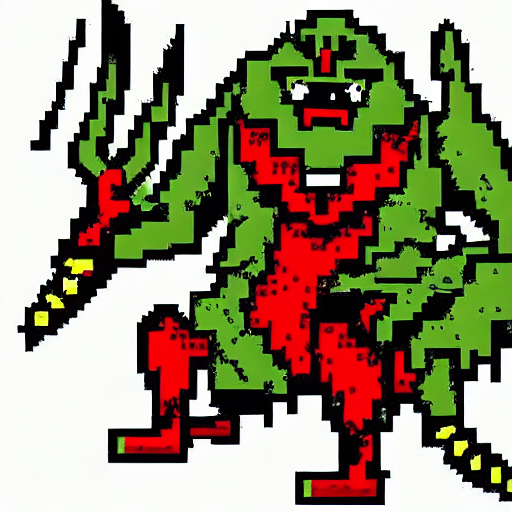
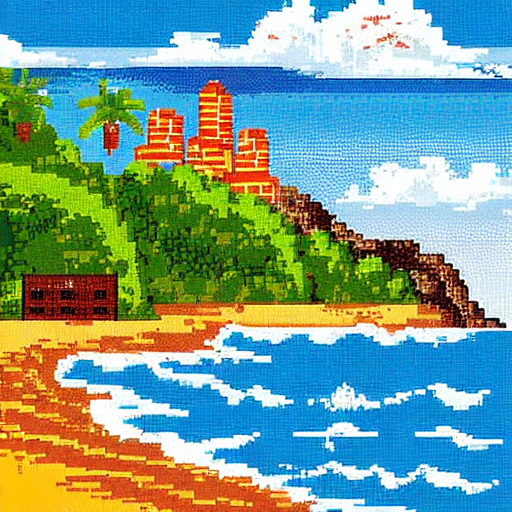

# *Parameter-Efficient Style Injection via Low-Rank Adaptation (LoRA)*

This project is an optimization harness designed to inject discrete structural styles into foundational text-to-image models. By freezing the complete 862-million parameter weight distribution of Stable Diffusion 1.5 and dynamically targeting the cross-attention layers, the network forces smooth, continuous spatial latents to snap into hard, quantized 16-bit pixel art arrangements.

---

## 🚀 Architectural Blueprint & Systems Footprint

The pipeline is engineered to maximize compute efficiency and eliminate out-of-core overhead on consumer hardware:
* **Trainable Parameter Constraining:** Restricts gradient tracking to a microscopic **0.37%** of the global network architecture (3,188,736 trainable parameters vs. 862,709,700 base parameters).
* **Zero-Disk Data Streaming:** Implements a custom PyTorch `IterableDataset` architecture that streams multi-modal text-image pairs directly from the Hugging Face Hub, bypassing local storage bottlenecks.
* **Low-Rank Configurations:** Structured with rank $r=16$ and scaling coefficient $\alpha=32$, targeting the $W_q, W_v$ projection layers to maximize stylistic extraction while maintaining strict semantic control.

---

## 🔬 Systems Analysis: Cross-Attention Hijacking

Foundational diffusion models carry intense, high-frequency structural priors for photorealism, continuous lighting gradients, and organic anti-aliasing. The pipeline intercepts the multi-head attention blocks (`to_q`, `to_k`, `to_v`, `to_out.0`), altering how text embeddings modulate spatial feature generation passes. 

### 🔍 Stylistic Generalization Matrix
The low-rank delta updates successfully rewrite how the Latent VAE space translates noise vectors into pixels, demonstrating robust zero-shot style generalization across highly diverse prompt distributions:

| Asset Synthesis Model (`asset, monster...`) | Environmental Open Domain (`vibrant beach...`) |
| :---: | :---: |
|  |  |

### 🛠️ Key Architectural Inversions:
1. **Dithering Simulation:** The adapter successfully teaches the model to mimic classic 8-bit/16-bit dithering techniques (alternating pixel clusters) to simulate value transitions across flat surfaces (e.g., sky and water gradients).
2. **Edge Clustering:** Soft mathematical transitions are replaced with hard, high-contrast, black-bordered stair-step pixels.
3. **Locking Base Model Coherence:** By locking the base weights completely (`requires_grad_(False)`), the model retains its underlying semantic vocabulary, allowing the new pixelated style to map cleanly to out-of-domain prompts without destroying the network's understanding of complex concepts.

---

## 🛠️ Installation & Execution Runtime

### 📦 Setup Environment
```bash
pip install torch diffusers transformers accelerate peft datasets pillow numpy
```

### 🏋️‍♂️ Run the Training Harness

Execute the optimization pass directly via the streaming Hugging Face pipeline:
```python
python train_lora.py
```

### 🎨 Run Inference Generation

Load the base foundational weights, fuse your newly minted .safetensors adapter state dictionary into the UNet graph, and test generalization:
```python
python generate_with_lora.py
```
